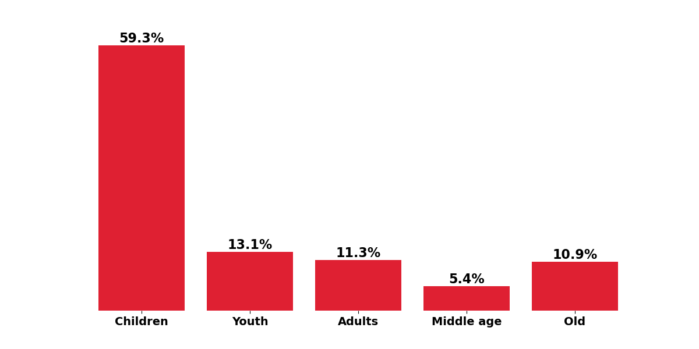

# Gender Prediction using SVM Model

This project aims to predict gender based on facial images using Support Vector Machine (SVM) model.

## Overview

The main objective of this project is to develop a machine learning model that can accurately predict the gender of individuals from facial images. Various techniques such as image augmentation, Principal Component Analysis (PCA), and baseline models have been explored to enhance the prediction accuracy.

## Dataset

[UTKFace dataset](https://www.kaggle.com/datasets/jangedoo/utkface-new) is a large-scale face dataset with long age span (range from 0 to 116 years old). The dataset consists of over 20,000 face images with annotations of age, gender, and ethnicity. The images cover large variation in pose, facial expression, illumination, occlusion, resolution, etc. This dataset could be used on a variety of tasks, e.g., face detection, age estimation, age progression/regression, landmark localization, etc.

## Techniques Explored

1. **Image Augmentation**: Augmentation techniques have been applied to increase the diversity and size of the dataset, enhancing the robustness of the model.

2. **Principal Component Analysis (PCA)**: PCA has been utilized for dimensionality reduction to improve model performance and efficiency.

3. **Baseline Model**: The most_frequent baseline model has been implemented as a benchmark for comparison. Despite its simplicity, it provides insights into the prediction accuracy achievable without sophisticated algorithms.

## Results

As a baseline, I used the Dummy Classifier (most frequent), which achieved **54%** accuracy. This result will serve as the threshold that we should surpass. 
After training the SVM model, we achieved **78%** accuracy, which is much better than the baseline. Additionally, we can examine the results of incorrect predictions and see that the majority of errors are made on children.

## Usage

1. Clone this repository.
2. Install the required dependencies.
3. Execute the preprocessing script to augment the dataset and perform PCA.
4. Train the SVM model using the processed dataset.
5. Evaluate the model's performance using test data.

## Contributors

- [Artur Mistiuk](https://github.com/ArturMistiuk) - Project Lead and Developer

## License

This project is licensed under the MIT License - see the [LICENSE](LICENSE) file for details.
